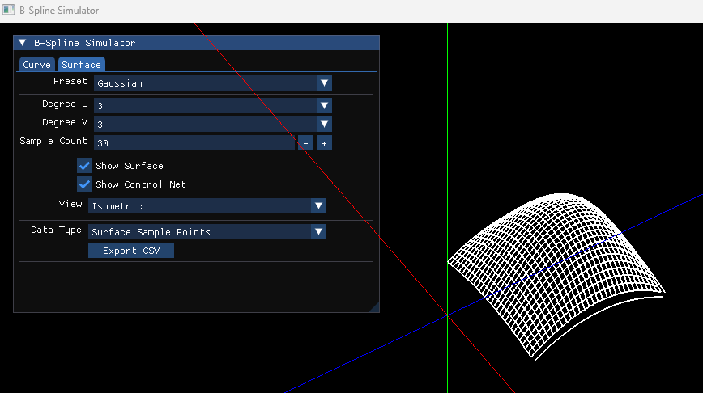
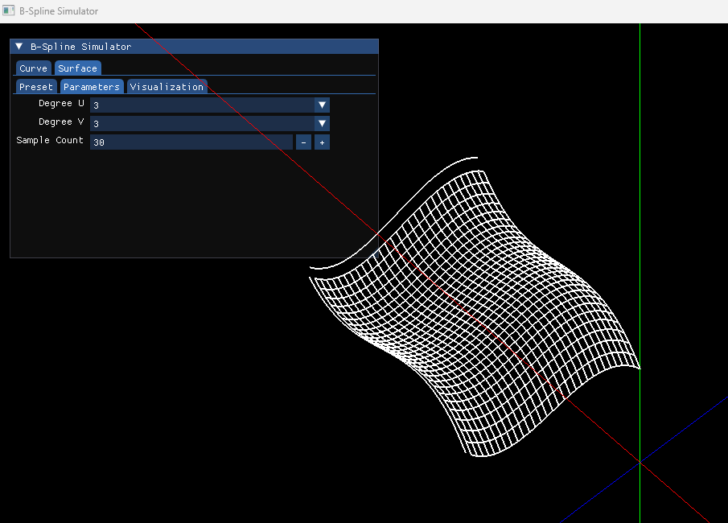

# B-Spline Simulator

Interactive B-Spline Curve and Surface Simulator written in C++ and OpenGL.
This project visualizes the mathematical foundations of B-Spline geometry including basis functions, curve evaluation, and freeform surface generation.
 
## Features
### Curve
- B-Spline Curve Evaluation
- Cox-De Boor Basis Function
- Control Polygon Visualization
- Curve Sampling
- Control Points / Knot vector CSV Export
- Basis Function CSV Export

### Surface
- B-Spline Surface Evaluation
- Control Net Visualization
- Surface Wireframe Rendering
- Surface Presets
  - Flat
  - Dome
  - Gaussian
  - Wave

## Visualization
- OpenGL Rendering
- Orbit Camera
- Zoom / Pan
- Interactive ImGui Interface

## UI
 

## Surface Presets
- Gaussian Surface
  

  
- Wave Surface
  
  

## Mathematical Foundation
### B-Spline Curve
P(t)=i∑​Ni,p​(t)Pi

### B-Spline Surface
​S(u,v)=i∑​j∑​Ni,p​(u)Nj,q​(v)Pij

where:
- ​Pi​​ = Curve Control Point
- Pij​ = Surface Control Point
- Ni,p​ = B-Spline Basis Function
- p,q = Degree
 
## Planned Features
- Surface Control Point Editing
- Surface Control Net Editor
- Triangle Mesh Generation
- Surface Shading
- NURBS Surface
- STEP Surface Import
- BREP Visualization
 
## Technologies
- C++
- OpenGL
- GLFW
- ImGui
- GeoKernel3D
