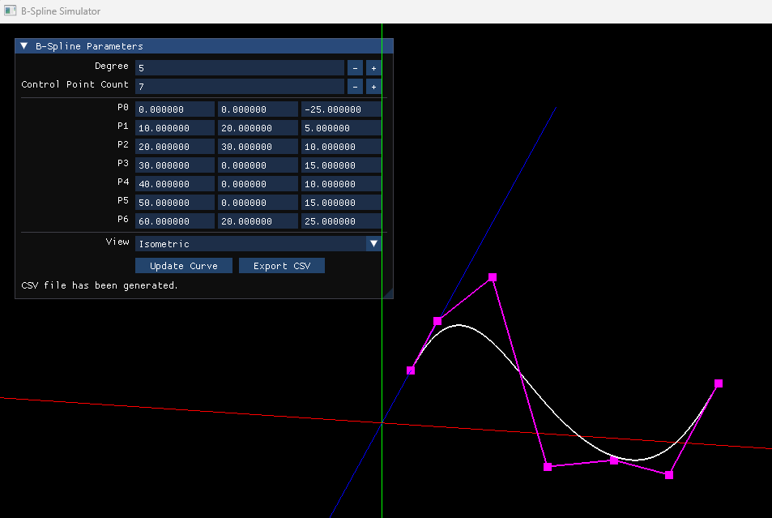

# B-Spline Simulator
 
Interactive B-Spline Curve and Surface Simulator written in C++ and OpenGL.
 
## Features
- B-Spline Curve Evaluation
- Cox-De Boor Basis Function
- Control Polygon Visualization
- Camera Orbit / Zoom
- OpenGL Rendering

 
 
## Current Status
### Implemented
- B-Spline Curve
- Basis Function Evaluation
- Polyline Generation
- Control Polygon Rendering
- Camera Controls
- CSV Export
- Interactive UI
 
### Planned
- B-Spline Surface
- Basis Function Visualization
 
## Technologies
- C++
- OpenGL
- GLFW
- GeoKernel3D
